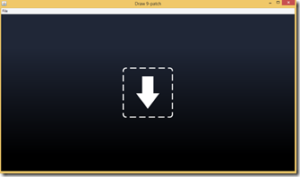
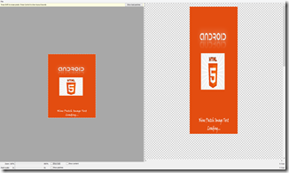
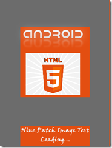
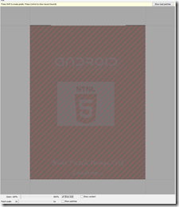
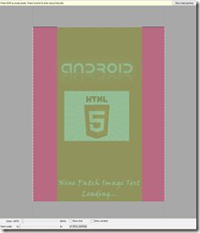
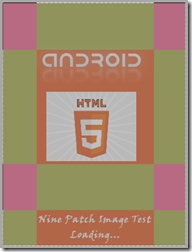
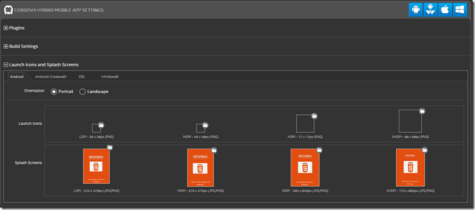
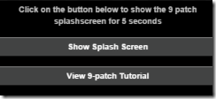

Introduction
============

This sample demonstrates how to use a nine-patch PNG images for Android\*
splash screens in your Cordova App. Developers must keep in mind that their
app should cater to different screen sizes and orientations. Android apps can
solve this problem by using nine-patch PNG images that can have stretchable
areas defined such that the image can be stretched without compromising the
end result.

What are nine-patch images?
---------------------------

A nine-patch image is a stretchable bit map. Android automatically resizes
your nine-patch image to accommodate changes in resolution and specific layout
constraints. When you create a nine-patch image, you can configure how the
image should be stretched if it needs to be resized. It must be saved with the
extension `.9.png`.

* * *

9-patch Tutorial using the `Draw 9-patch tool`
----------------------------------------------

Create four PNG images of your splash screen:

Due to varied screen sizes and resolutions of Android devices in the market,
Android has separated all of its screen sizes into distinct screen densities:

* Low Density (ldpi ~ 120dpi)
* Medium Density (mdpi ~ 160dpi)
* High Density (hdpi ~ 240dpi)
* Extra-High Density (xhdpi ~ 320dpi) 
* etc.

> Note: These dpi values are approximations, since custom built devices
> will have varying dpi values.

You will have to create four PNG images of your desired splash screen, one for
each of the following screen density:

|    Density    | Width | Height |
|:------------- |:-----:|:------:|
| ldpi (Small)  |  320  |  426   |
| mdpi (Medium) |  320  |  470   |
| hdpi (Large)  |  480  |  640   |
| xdpi (XLarge) |  720  |  960   |

> Note: The splash screen resolutions specified above, and on the Icons and
> Splash Screens section of the **Projects** tab, are **minimum** recommended
> dimensions, not **absolute** required dimensions.

Differing screen sizes, wide screen, orientation are all factors that
contribute to the image stretching to fit the screen. So your only options are
to either create an image for each screen size/density combination, or create
four 9-patch images. Once these four images have been converted to 9-patch,
Android* will select the appropriate file for the device’s image density and
then stretch the image according to the the device standard. If you choose to
design a splash screen for every single resolution, you can start by following
the resolutions in the table at the end of [this Android Developer page][1].

[1]: http://developer.android.com/guide/practices/screens_support.html#testing

> Note: If you choose to create just one 9-patch image of size 720x960, you
> have to note that 9-patch images only **stretch** and not **shrink**. While
> it may look great on a tablet, displaying it on a standard mobile device of
> size 320x470, text and other elements will look very small and lose
> legibility. To ensure that no shrinking will occur, you have to design in
> the lowest common resolution for each density category.

In the sample source files, you will find two sets of images: four original
images ending with `.png` and their 9-patch counterparts ending with `.9.png`.

Convert each PNG splash screen image to 9-patch:
------------------------------------------------

We are going to be using the Draw 9-patch tool from Android* to do this.

> Note: Any PNG image editor that can mark pixels in a transparent color can
> be used.

**Step 1:** Launch Tool. Draw9patch.bat is part of
  [Android SDK](https://developer.android.com/sdk/index.html) and can be
  launched from the sdk/tools folder.

**Step 2:** Import your PNG image to the tool by either dragging it into the
  window or locate the file using Ctrl+O.

**Step 3:** Analyze your image and decide which areas you want to preserve
  (make non-scalable) and which areas you would like to stretch (will distort).

Here is what the original image looks like:

   

Here is how it will look like when the device stretches it vertically and
horizontally (this can be viewed on the preview area – right pane of the tool)

We want the HTML5 logo to be centered in the middle, the ‘**android**’ text
above the logo and the ‘**Nine Patch Image Test Loading…**’ text at the bottom
of the image. This leaves the areas in grey open for stretching:

**Step 4:** Specify areas for stretching in Draw 9-patch tool.

Check the ‘Show lock’ Checkbox (found at the bottom pane of the tool). When
you mouse over, it will show you the non-drawable area of the image. You will
find a small one pixel perimeter around the image where you can draw a line to
specify areas you want to stretch.

Check the ‘Show patches’ checkbox which shows the stretchable patches in pink
on the image. Click within the 1 pixel perimeter to draw lines that define the
stretchable patches. **Draw lines only on the top and left borders**. The pink
patch areas will be stretched if the splash screen needs to be resized.

On the preview pane, you can see how your 9-patch image now looks when
stretched vertically and horizontally:

Much better.

**Step 5:** Save 9-patch image (File > Save 9-patch) which would save it with
  the .9.png extension. Android* will identify your image as a nine-patch
  graphic using this extension so do not change it.

**Step 6:** Create three more 9-patch images for your other image sizes.

* small (ldpi): 320x426
* medium (mdpi): 320x470
* large (hdpi): 480x640
* xlarge (xhdpi): 720x960

**Step 7:** Add your 9-patch images to your project directory from which Intel
  XDK is reading from. Ensure that the Cordova* Splash screen plug-in has been
  selected from the projects tab.

Go to the Projects tab of your app > Cordova* Hybrid Mobile App Settings >
Launch Icons and Splash screens > Add your splash screens by using the little
folder icon to locate them.

In `init-app.js`, your auto generated code will call the `hideSplashScreen()`
method.

~~~~JavaScript
app.hideSplashScreen() ;    // after init is good time to remove splash screen
~~~~

The splash screen plug-in removes the splash screen after the default timeout
or the `hideSplashScreen()` function is called, whichever comes first. You
can increase the default timeout via the `intelxdk.config.additions.xml` file:

	<!-- "value" is the minimum time, in milliseconds, to show the launch or splash screen -->
	<preference name="SplashScreenDelay" value="2000" /></pre>

The ‘Show Splash Screen’ button will display the splash screen for five seconds.

Run the app on a variety of devices to see how different screen sizes and
aspect ratios change the splash screen to see the difference nine-patch images
make.

> Note: You can run this app in the Simulator or the Test tabs, but you will
> not see the custom splash screens. You must build and install the app on an
> Android device to see the custom splash screen.

* * *

References:

* <http://developer.android.com/tools/help/draw9patch.html>
* <http://developer.android.com/guide/topics/graphics/2d-graphics.html#nine-patch>
* <http://radleymarx.com/blog/simple-guide-to-9-patch/>
* <http://stackoverflow.com/questions/10574363/android-splash-screen-image-sizes-to-fit-all-devices>
* <https://software.intel.com/en-us/xdk/docs/cordova-for-android-build-options>
